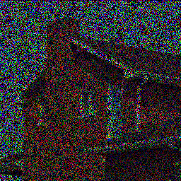
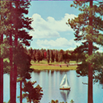
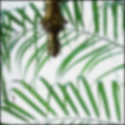
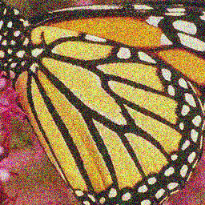
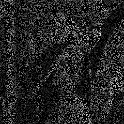

# MMES
Manifold Modeling in Embedded Space (MMES): An Interpretable Alternative to Deep Image Prior  
It is published in IEEE Transactions on Neural Networks and Learning Systems  
Please download our paper from IEEE (Open Access) : https://ieeexplore.ieee.org/abstract/document/9281370  
Link to arXiv paper : https://arxiv.org/abs/1908.02995

It is implemented by using TensorFlow (please try our codes for image inpainting, super-resolution, deconvolution, and denoising)

 - [demo_MMES_IP(inpainting)](demo_MMES_IP(inpainting).ipynb) recovers the following incomplete image with missing entries (70% pixels are missing)  
 
 
 - [demo_MMES_SR(super-resolution)](demo_MMES_SR(superresolution).ipynb) recovers the following low resolution image (128 x 128) to (512 x 512)  
 
 
 - [demo_MMES_DC(deconvolution)](demo_MMES_DC(deconvolution).ipynb) recovers the following blurred image with Gaussian kernel  
 
 
 - [demo_MMES_DN(denoising)](demo_MMES_DN(denoising).ipynb) recovers the following noisy image  
 
 
 - Additional Inpainting Demo. for [gray-scale image](demo_MMES_IP(inpainting)_gray.ipynb) and [binary image](demo_MMES_IP(inpainting)_binary.ipynb) were uploaded  
  
 .png)
